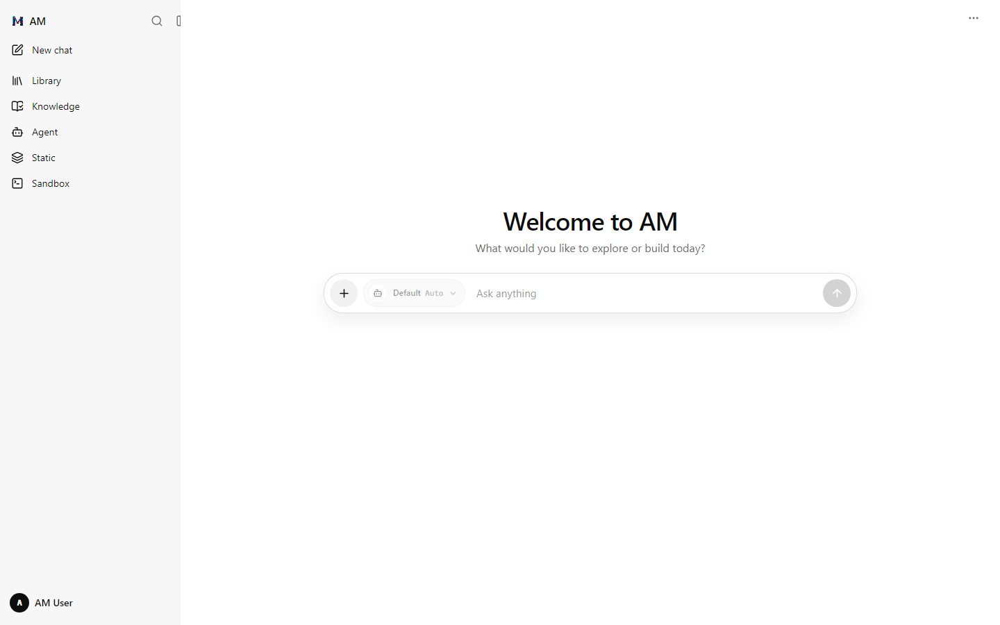
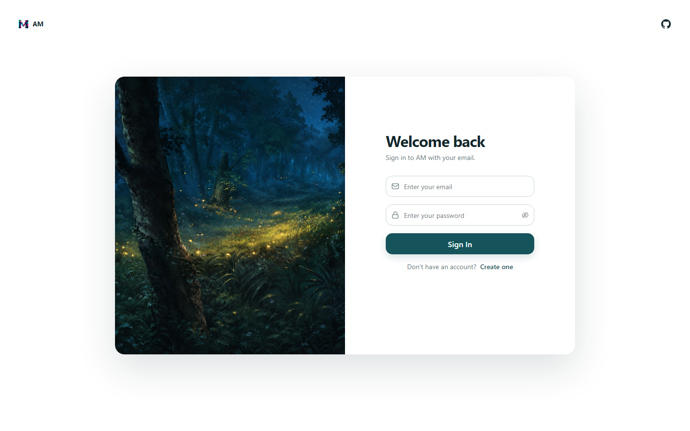
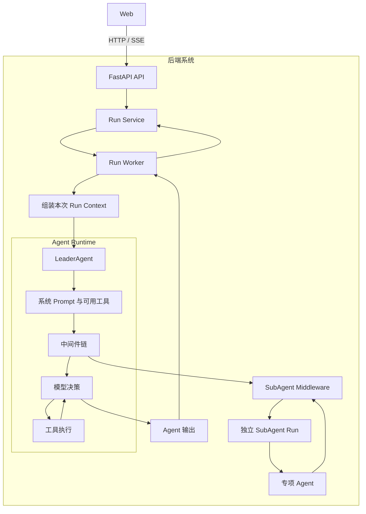
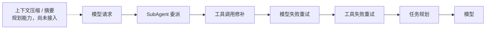
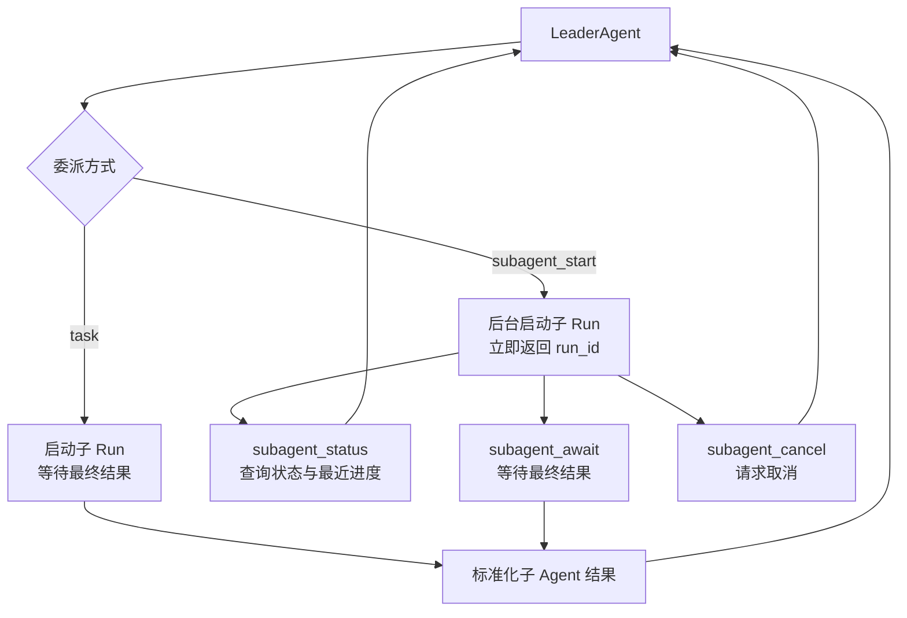
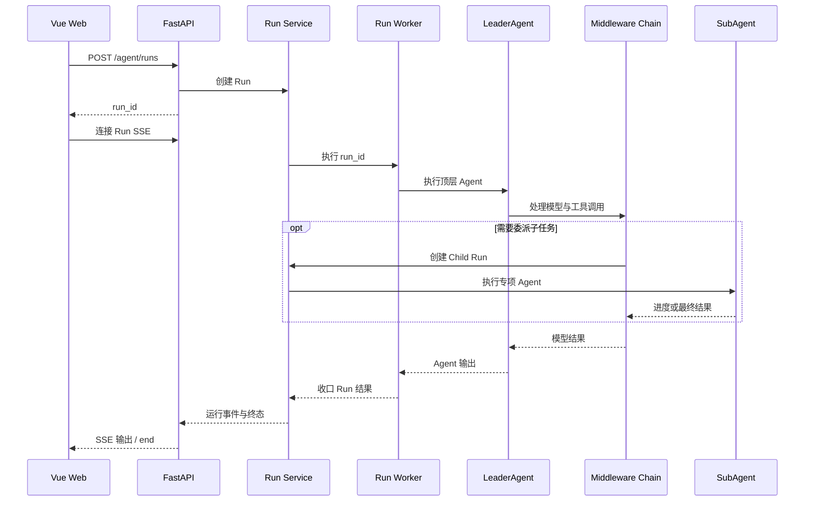

<!-- markdownlint-disable MD033 MD041 -->

# agent-stack

🤖 通用多智能体系统，面向智能体编排、交互与应用开发。

A general-purpose multi-agent system for agent orchestration, interaction, and application development.

## 🎯 项目定位

本仓库是用于技术学习与工程实践的阶段性项目。第一阶段聚焦 Web 应用形态，构建类似
ChatGPT 的交互体验，并验证多智能体编排、任务协作与工具调用等核心能力。

后续阶段将依次探索以下产品形态：

1. 命令行工具（CLI），提供终端环境中的任务执行与自动化能力。
2. Coding Agent，面向代码理解、生成、修改与工程协作场景。
3. 桌面级应用，整合本地资源、工作区与更完整的交互能力。

项目将在上述形态演进的基础上，持续扩展智能体协作、知识检索、工具调用、内容生成、
任务自动化及其他通用能力。

## 🛠️ 主要技术栈

| 领域 | 技术 |
| --- | --- |
| 后端服务 | Python 3.13、FastAPI、Pydantic、Uvicorn |
| 智能体与工作流 | LangChain、LangGraph、Deep Agents |
| 数据持久化 | PostgreSQL、SQLAlchemy、Alembic |
| 异步任务与事件流 | Redis、ARQ、Server-Sent Events（SSE） |
| 知识与文件存储 | Milvus、MinIO |
| 模型与工具集成 | OpenAI-compatible API、MCP、A2A、Tavily |
| Web 前端 | Vue 3、TypeScript、Vite 7、Vue Router 4 |
| 工程与部署 | uv、Docker Compose、Ruff |

## 🖼️ 界面预览

### 聊天主界面

### 登录界面

## 🏗️ 系统架构

### 后端总体架构

前端只通过 HTTP 发起请求，并通过 SSE 接收运行输出。后端负责 Run 编排、运行上下文组装、
Agent 执行、工具调用和子 Agent 委派。

### LeaderAgent 中间件

中间件在模型与工具调用周围提供委派、修补、重试和任务规划能力。上下文压缩与摘要已有设计方向，
但当前尚未接入 `LeaderAgent` 中间件链。

### SubAgent Middleware

`SubAgentMiddleware` 把 LeaderAgent 的工具调用转换为独立的子 Run，并始终校验子 Run 属于当前父 Run。
专项 Agent 只返回有界结果，由 LeaderAgent 继续整合，不绕过父流程直接产生最终答案。

### 后端 Run 执行链路

## 📖 文档

- [系统架构与模块边界](docs/architecture/README.md)
- [能力规格](docs/spec/README.md)
- [本地开发、启动与验证](docs/development.md)
- [数据库迁移样例](migrate/README.md)
- [贡献与提交规范](CONTRIBUTING.md)
