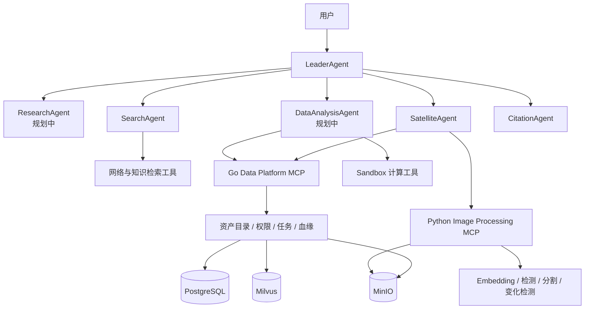
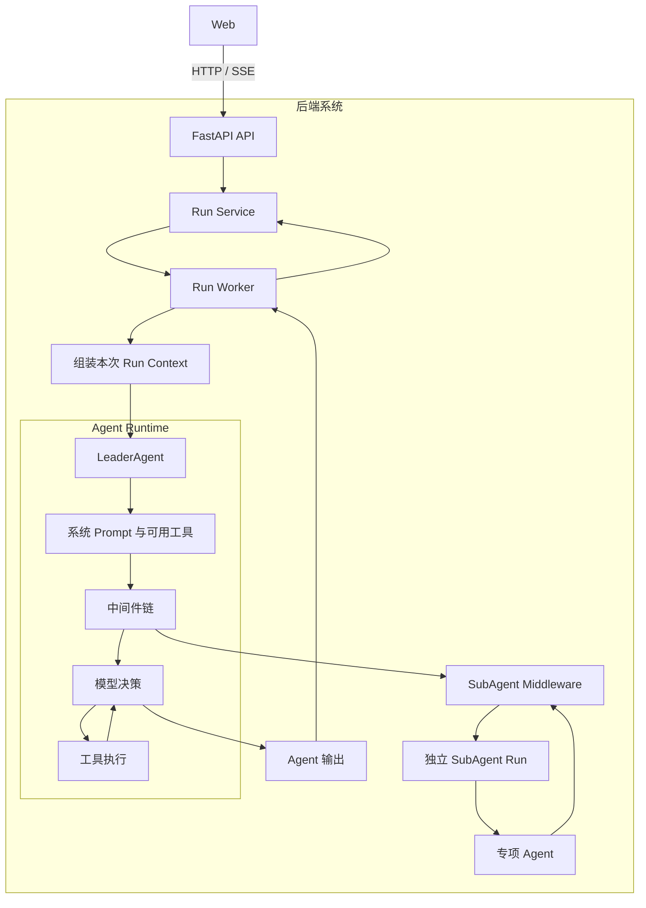
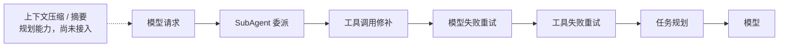
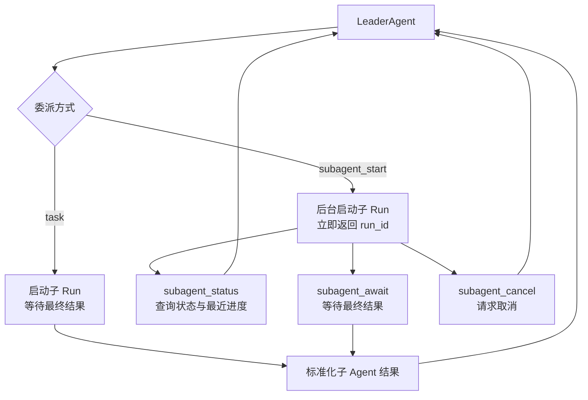
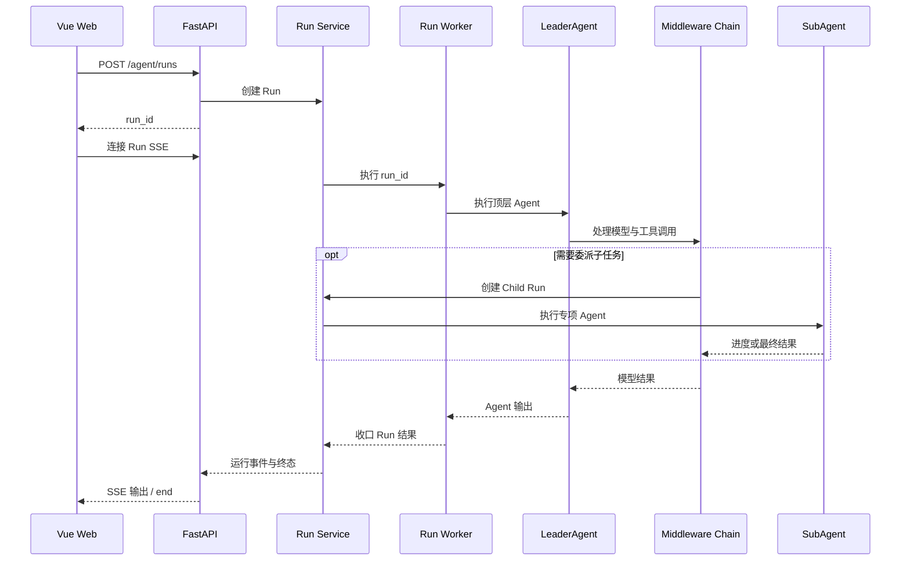

<!-- markdownlint-disable MD033 MD041 -->

<div align="center">


# agent-stack

🤖 通用多智能体系统，面向智能体编排、交互与应用开发。

A general-purpose multi-agent system for agent orchestration, interaction, and application development.

</div>

## 🎯 项目定位

本仓库是用于技术学习与工程实践的阶段性项目。第一阶段聚焦 Web 应用形态，构建类似
ChatGPT 的交互体验，并验证多智能体编排、任务协作与工具调用等核心能力。

后续阶段将依次探索以下产品形态：

1. 命令行工具（CLI），提供终端环境中的任务执行与自动化能力。
2. Coding Agent，面向代码理解、生成、修改与工程协作场景。
3. 桌面级应用，整合本地资源、工作区与更完整的交互能力。

项目将在上述形态演进的基础上，持续扩展智能体协作、知识检索、工具调用、内容生成、
任务自动化及其他通用能力。

## 🛰️ 数据中台与专项 Agent 规划

项目计划从卫星与图像数据切入，验证 Agent 在多数据源检索、结构化数据分析、图像推理和
受控数据操作中的完整执行链。目标形态不是让 Agent 直接访问数据库或模型，而是由 Agent
理解任务和编排能力，通过 MCP 调用数据中台及图像处理服务。

### Agent 职责

| Agent | 状态 | 职责 |
| --- | --- | --- |
| `LeaderAgent` | 已实现 | 理解用户目标、选择专项 Agent、协调子 Run，并汇总最终结果 |
| `SearchAgent` | 已实现 | 执行有界的网络与知识库检索，返回去重、可追溯的检索证据，不负责完整研究结论 |
| `CitationAgent` | 已实现 | 校验声明与实际检索片段的对应关系，发现缺失、错误或不足的引用 |
| `SatelliteAgent` | 已实现 | 连接多个卫星数据源，根据任务选择目录检索、单时相解译或多时相变化分析工具 |
| `ResearchAgent` | 规划中 | 拆解研究问题、组织多轮证据收集、识别冲突与证据缺口，并形成结构化研究简报 |
| `DataAnalysisAgent` | 规划中 | 分析跨数据源的表格、指标和时序数据，执行统计计算并返回可复核的数据结论 |

`ResearchAgent` 与 `SearchAgent` 的边界是“研究”与“检索”：前者负责问题分解、证据覆盖、
冲突处理和研究综合，后者只负责从指定来源取得证据。`CitationAgent` 保持独立，负责在交付前
验证关键声明，不与搜索过程合并。

图像模型、数据 CRUD 和文件处理不单独设计为 Agent。它们输入输出明确，应作为 MCP Tool
或 Sandbox Tool 供专项 Agent 调用：

- 图像 Embedding、目标检测、分割、配准和变化检测由 Python Image Processing MCP 提供。
- 数据资产增删改查、权限、任务、版本和血缘由 Go Data Platform MCP 提供。
- 裁剪、格式转换、报告和产物生成等确定性操作由 Sandbox Tool 执行。
- 创建、修改、发布和删除等有副作用的操作必须经过权限校验、幂等控制和必要的用户确认。

### 目标协作拓扑



### 数据中台边界

Go 数据中台是业务状态与数据生命周期的所有者，对 Web 提供普通 HTTP API，对 Agent 提供
MCP Tool；两种入口复用同一组 Application Service，不维护两套 CRUD 逻辑。它负责资产目录、
权限、版本、处理任务、幂等、审计和输入输出血缘，并协调 PostgreSQL、MinIO 与 Milvus。

Python Image Processing MCP 负责模型加载和图像计算。短任务可以同步返回结构化结果；耗时的
GPU 推理和批量处理创建异步任务并返回 `job_id`。图像输入输出使用 `asset_id` 和受控对象地址，
不把大型 Base64、数据库凭据或永久对象存储凭据交给 Agent。

```text
SatelliteAgent / DataAnalysisAgent
    -> MCP Tool
    -> Go 数据中台业务服务
    -> PostgreSQL / MinIO / Milvus / 外部数据源

SatelliteAgent
    -> Python Image Processing MCP
    -> Python / GPU Worker
    -> Go 数据中台登记结果资产与数据血缘
```

首个端到端场景计划使用卫星图像：由 `SatelliteAgent` 从多个目录查找影像，调用 Python MCP
完成预处理和推理，再通过 Go MCP 保存数据资产、任务状态和处理结果。单时相与多时相属于同一
Agent 下的不同工具策略，不拆成多个 Agent。

## 🛠️ 主要技术栈

| 领域 | 技术 |
| --- | --- |
| 后端服务 | Python 3.13、FastAPI、Pydantic、Uvicorn |
| 智能体与工作流 | LangChain、LangGraph、Deep Agents |
| 数据持久化 | PostgreSQL、SQLAlchemy、Alembic |
| 异步任务与事件流 | Redis、ARQ、Server-Sent Events（SSE） |
| 知识与文件存储 | Milvus、MinIO |
| 模型与工具集成 | OpenAI-compatible API、MCP、A2A、Tavily |
| Web 前端 | Vue 3、TypeScript、Vite 7、Vue Router 4 |
| 工程与部署 | uv、Docker Compose、Ruff |

## 🖼️ 界面预览

### 聊天主界面


### 登录界面


## 🏗️ 系统架构

<div align="center">


</div>

### 后端总体架构



前端只通过 HTTP 发起请求，并通过 SSE 接收运行输出。后端负责 Run 编排、运行上下文组装、
Agent 执行、工具调用和子 Agent 委派。

### LeaderAgent 中间件



中间件在模型与工具调用周围提供委派、修补、重试和任务规划能力。上下文压缩与摘要已有设计方向，
但当前尚未接入 `LeaderAgent` 中间件链。

### SubAgent Middleware



`SubAgentMiddleware` 把 LeaderAgent 的工具调用转换为独立的子 Run，并始终校验子 Run 属于当前父 Run。
专项 Agent 只返回有界结果，由 LeaderAgent 继续整合，不绕过父流程直接产生最终答案。

### 后端 Run 执行链路



## 📖 文档

- [系统架构与模块边界](docs/architecture/README.md)
- [能力规格](docs/spec/README.md)
- [本地开发、启动与验证](docs/development.md)
- [数据库迁移样例](migrate/README.md)
- [贡献与提交规范](CONTRIBUTING.md)
