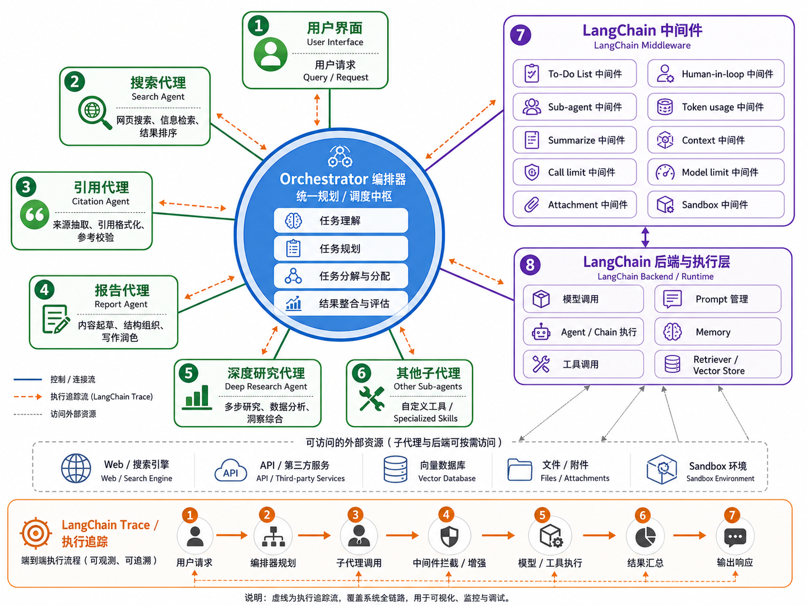

# multi-agent-s2c

类 GPT 的通用多智能体对话系统，支持多轮对话、多智能体协作、知识库检索、工具调用与流式响应。

leejuju 智能体宇宙的第一步。

本仓库是用于技术学习与工程实践的阶段性项目，目前处于第一阶段。项目定位为通用多智能体系统，聚焦 Web 应用形态，构建类似 ChatGPT 的交互体验，并验证多智能体编排、任务协作与工具调用等核心能力。

后续阶段将依次探索以下产品形态：

1. 命令行工具（CLI），提供终端环境中的任务执行与自动化能力。
2. Coding Agent，面向代码理解、生成、修改与工程协作场景。
3. 桌面级应用，整合本地资源、工作区与更完整的交互能力。

项目将在上述形态演进的基础上，持续扩展智能体协作、知识检索、工具调用、内容生成、任务自动化及其他通用能力。

## 项目描述

multi-agent-s2c 是一个从零构建的类 ChatGPT Web 应用，后端基于 FastAPI + LangChain/LangGraph 多智能体框架，前端使用 Vue 3，目标构建类似 Mulerun 的 Web 端交互体验。

系统支持多智能体协作编排，主 Agent 可动态调度搜索 Agent、大纲 Agent 等子 Agent 完成复杂任务，后台通过异步队列执行并支持任务取消。知识库模块支持文档上传、解析、分块与向量索引，结合 Embedding 模型实现语义检索与 RAG 问答。

## 主要功能

- 用户注册登录（JWT 认证）
- 多轮对话管理与流式响应（SSE）
- 多智能体协作（任务编排、子 Agent 调度与取消）
- 知识库管理（文档解析、向量索引、语义搜索）
- 工具调用（联网搜索、MCP 工具集成）

## 技术栈

| 领域 | 技术 |
| --- | --- |
| 后端框架 | Python 3.13、FastAPI、Uvicorn |
| 智能体框架 | LangChain、LangGraph、Deep Agents |
| 数据库 | PostgreSQL、SQLAlchemy、Alembic |
| 异步任务 | Redis、ARQ |
| 实时通信 | Server-Sent Events（SSE） |
| 向量数据库 | Milvus |
| 对象存储 | MinIO |
| 模型集成 | OpenAI-compatible API、MCP、Tavily |
| 前端 | Vue 3、TypeScript、Vite 7、Vue Router 4 |
| 工程工具 | uv、Docker Compose、Ruff |

## 系统架构

## Contributing

See commit and PR conventions in [CONTRIBUTING.md](./CONTRIBUTING.md).
