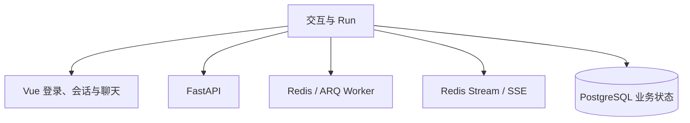
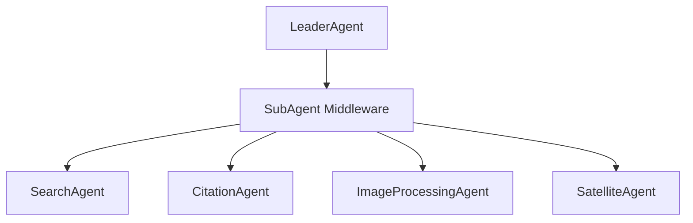
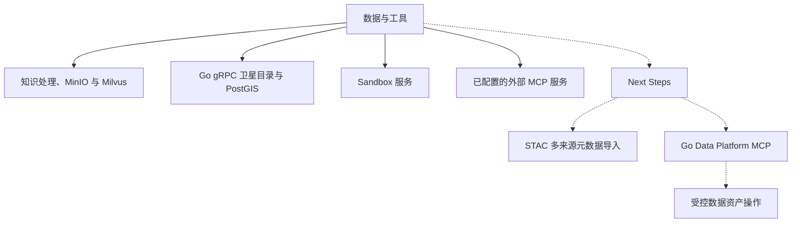

<!-- markdownlint-disable MD033 MD041 -->

<div align="center">


# agent-stack

基于 FastAPI、LangGraph 和 Vue 的多智能体应用，用于技术学习与工程实践。

</div>

## 当前系统

Web 端提供登录、会话和聊天界面。FastAPI 创建 Agent Run，Redis/ARQ Worker 执行任务，Redis Stream 承载运行事件并由 API 通过 SSE 返回给前端。PostgreSQL 保存用户、会话、消息和 Run 状态。

`LeaderAgent` 通过子智能体中间件委派任务，当前接入以下内部子智能体：

| 子智能体 | 当前职责 |
| --- | --- |
| `SearchAgent` | 网络与知识库检索 |
| `CitationAgent` | 核对回答声明与检索证据 |
| `ImageProcessingAgent` | 装配已配置的图像处理 MCP 工具，并校验工具返回的内嵌单帧图像能否完整解码 |
| `SatelliteAgent` | 通过 Go Gateway 查询卫星影像目录，并按需调用已配置的处理工具 |

知识模块负责文件解析、切块、索引与检索；MinIO 保存文件和解析产物，Milvus 保存向量索引。`sandbox_server/` 提供独立的受控工具与代码执行服务。MCP 服务需单独部署并在 `.env` 中配置，未配置时相应工具不可用。

卫星目录由 Go `gateway/` 通过 gRPC 提供来源列表、场景空间/时间检索和场景详情。Gateway 查询 Alembic 管理的 PostgreSQL/PostGIS 表；目录保存影像对象引用，不保存影像二进制。

## 系统结构

以下按职责分别展示；实线表示当前已有模块，虚线表示 Next Steps。

### 交互与 Run



### Agent 编排



### 数据与工具



| 目录 | 职责 |
| --- | --- |
| `server/` | FastAPI 路由、业务服务和 ARQ Worker |
| `src/agents/` | LeaderAgent、子智能体、工具与中间件 |
| `src/knowledge/` | 文件处理和知识检索 |
| `src/database/`、`src/storage/` | 数据库仓储与基础设施适配 |
| `gateway/` | Go gRPC 卫星目录与 PostGIS 查询 |
| `sandbox_server/` | 独立的执行隔离服务 |
| `web/` | Vue 前端 |
| `migrate/` | Alembic 数据库迁移 |
| `docker-compose.yml`、`docker/` | 服务编排与镜像配置 |

## Next Steps

1. **卫星数据资源库**：在现有目录表和 Go Gateway 基础上，完善 Asset key 迁移与 gRPC 契约；导入经过校验的 STAC 1.1.0 多来源元数据，并验证目标库的迁移、空间查询和项目隔离。详见[实施计划](docs/spec/data-platform/satellite-imagery-catalog/plan.md)和[任务清单](docs/spec/data-platform/satellite-imagery-catalog/tasks.md)。
2. **Go Data Platform MCP**：先定义接口与数据所有权，再提供面向 Agent 的受控资产操作、权限校验、处理任务、版本和血缘工具。该服务尚未实现；当前卫星目录查询仍走 `SatelliteAgent → Python gRPC 客户端 → Gateway`。

## 本地启动

需要 Python 3.13+、uv、Docker Compose 和 Node.js/npm。先把 `.env.template` 复制为 `.env`，填写实际使用的模型及外部工具配置：

```powershell
Copy-Item .env.template .env
uv sync
docker compose up -d postgres redis minio milvus
uv run --no-sync alembic upgrade head
docker compose up -d --build gateway sandbox api worker
```

另开终端启动前端：

```powershell
cd web
npm ci
npm run dev
```

需要固定的卫星目录测试数据时，可在迁移后执行 `uv run --no-sync python scripts/load_satellite_catalog_fixture.py`。Compose 数据卷位于 `save/volume/`。RustFS 目前是可选独立服务，应用仍使用 MinIO。更多命令见[开发指南](docs/development.md)。

## 界面预览


## 文档

- [系统架构与模块边界](docs/architecture/README.md)
- [能力规格索引](docs/spec/README.md)
- [本地开发与验证](docs/development.md)
- [卫星目录 Gateway](gateway/README.md)
- [贡献规范](CONTRIBUTING.md)
