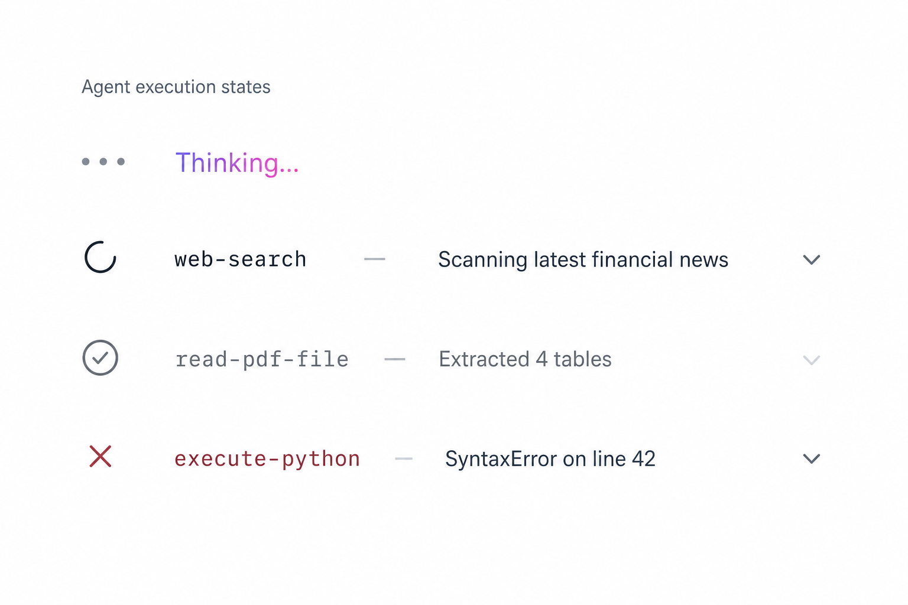
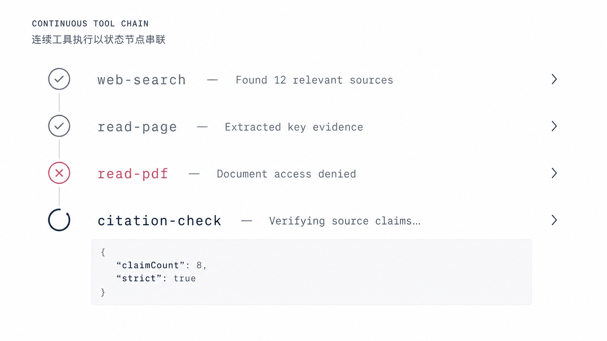
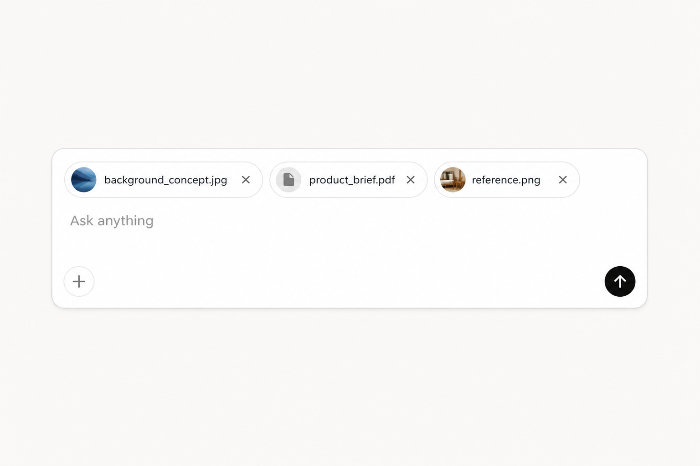

# Chat 页面与流式消息设计

## 1. 设计目标

本设计改造 `web/src/views/ChatView.vue` 及其直接调用链，目标是形成一个职责明确、能够承接真实 Thread、Agent Run 和 SSE 输出的 Chat 区域。

目标行为如下：

1. `/` 没有后端消息时，问候语和 `ChatMessageInputComponent` 作为一个整体在页面可用区域内居中。
2. 用户第一次提交后，前端立即追加一条 Human Message 作为乐观显示并清空输入，因此消息区立刻出现、输入区立刻移动到底部；它不携带 `pending` 状态，后端 Thread 返回后用持久化消息整体替换。
3. `role="user"` 的 Human 消息使用有颜色的消息面；`role="assistant"` 的 AI 消息不使用气泡背景、边框或有色容器。
4. 收到后端 SSE `status=running` 且尚未收到第一段 AI 正文时，显示三点呼吸动画和带紫色到粉色文字 shimmer 的 `Thinking...`；Run 的 `pending` 状态不在前端渲染。
5. 规范化后的 `agent_execute_event` 使用无容器单行排版显示工具执行中、完成、失败或停止；同一 live Run 中连续出现的 Tool 节点按首次到达顺序堆叠并用连接线串联。后端只提供 Tool 事件，前端根据事件类型推导显示状态。
6. AI 正文使用项目已经安装的 `markstream-vue` 渲染不断增长的 Markdown 字符串。
7. Chat 组件归入独立的 `web/src/components/chat/` 功能目录。
8. `ChatMessageInputComponent.vue` 内敛原生 `div[contenteditable="plaintext-only"]`、Attach/Send/Cancel `AButton`、`ATooltip` 和 file input；输入框内部仍是编辑区在上、按钮在下。
9. `ChatView.vue` 直接 `v-for` 渲染消息；`ChatMessageShowComponent.vue` 只接收一条显示项，直接渲染 Human、AI、Thinking 和 Error，Tool 分支只暴露一个 scoped slot，由父组件插入统一的 `AgentToolComponent.vue`。
10. 不再拆 `ChatMessageTextareaComponent.vue` 或 `ChatMessageInputActionsComponent.vue`。`ChatMessageInputComponent.vue` 只保留一个 `attachments` slot，父组件把统一的 `AttachmentComponent.vue` 胶囊列表填到有边框输入框的内部上方。
11. 附件启用时，Attach 按钮选择、拖拽文件到输入区和粘贴剪贴板文件都汇入同一个附件添加事件与上传链路，不新增 Dropzone 或 Paste 组件。
12. `web/src/api/chat.ts` 是 Chat 页面所需接口的集成模块；组件不直接调用 `fetch`，API 模块也不保存 Vue 页面状态。

用户原文中的 `ChatMesssageInputComponet` 统一修正为符合仓库命名规则的 `ChatMessageInputComponent.vue`，不保留错误拼写别名。

本文件是实现前规格。用户确认前，不修改 Chat 源码、后端事件契约或目录结构。

## 2. 当前实现核对

### 2.1 当前仅存在于浏览器本地的链路

当前 Chat 并未连接后端：

```text
ChatView.vue
  -> ConversationComponent.vue
  -> MessageListComponent.vue / MessageInputComponent.vue
  -> useLocalChat.ts
  -> module-level Vue state + localStorage
```

具体事实：

- `useLocalChat.ts` 生成浏览器本地 Conversation ID，并把内容写入 `opengpt.design.conversations.v1`。
- `LocalMessage.role` 只有 `"user"`，不存在 AI 消息或 Agent Run 状态。
- `/c/:conversationId` 当前使用本地 ID，不是后端 `Conversation.thread_id`。
- `MessageListComponent.vue` 只渲染纯文本 Human 消息，并显示“尚未连接模型”的本地提示。
- `MessageInputComponent.vue` 已有 textarea 自动增高，但为了在单行/多行之间切换按钮布局，引入了隐藏测量 textarea、`ResizeObserver` 和 `stackActions`。目标结构固定为上下两层后，这些逻辑全部不再需要。
- `web/src/api/` 当前为空。
- `AuthenticationView.vue` 的提交函数是 `submitPreview()`，只做表单校验并显示“接口将在下一阶段接入”，没有登录请求、Access Token 所有者或认证请求封装。

因此，现有页面上的会话、附件选择和路由切换只是本地 UI 状态，不能描述为后端 Thread、持久化 Message 或 Agent 输出。

### 2.2 后端已经存在的接口

后端已经提供以下受 Bearer Token 保护的接口：

| 方法 | 路径 | Chat 用途 |
| --- | --- | --- |
| `POST` | `/api/chat/thread` | 创建顶层 Thread |
| `GET` | `/api/chat/thread` | 加载或搜索 Thread 列表 |
| `GET` | `/api/chat/thread/{thread_id}` | 加载 Thread 及持久化消息 |
| `GET` | `/api/chat/agents` | 读取公开顶层 Agent |
| `POST` | `/api/chat/attachment/tmp/upload` | 上传用户附件到临时存储 |
| `POST` | `/api/agent/runs` | 持久化 Human Message、创建并入队 Agent Run |
| `GET` | `/api/agent/runs/{run_id}/events?thread_id=...` | 读取 Run 的 SSE 事件 |
| `POST` | `/api/agent/runs/{run_id}/cancel` | 请求取消 Run |

`POST /api/agent/runs` 返回 `run_id`、`thread_id`、`status`、`request_id` 和带查询参数的 `stream_url`。前端必须使用响应中的 `stream_url`，不能自行重复拼接另一套路径。

### 2.3 当前仍未接通的公共契约

#### 前端认证

Thread、上传、Agent Run 和 SSE 都依赖 `AuthenticatedUser`。当前前端没有 Access Token，也没有能给普通请求和流式请求统一添加 `Authorization: Bearer ...` 的所有者。

在认证链路被单独设计并确认前，不能用以下方式绕过：

- 匿名请求或后端默认用户；
- 写死开发 Token；
- `VITE_*` 中保存私有 Token；
- 伪造登录成功状态；
- 只实现一批无人调用的 Chat API 方法。

#### SSE 消息正文

当前 Worker 的实时 `messages` 事件把 `(BaseMessageChunk, metadata)` 直接作为 payload 写入 Redis。Redis 写入层使用 `json.dumps(..., default=str)`，因此消息对象可能变成 Python 字符串表示，不是浏览器可稳定消费的正文契约。

数据库兜底事件又使用另一种结构：

```json
{
  "type": "messages",
  "payload": [
    {
      "event": "content-block-finish",
      "content": { "text": "完整正文" }
    }
  ]
}
```

前端不得通过正则解析 Python 对象字符串，也不得同时猜测多套 payload。要接入真正的流式 Markdown，后端需要先把实时和兜底消息规范化为稳定 JSON，见第 8 节。

#### 附件到 Agent 的完整链路

临时上传接口会真实写入 MinIO 和 `Attachment(status="pending")`，`msg_metadata.file_ids` 也会随 Message 持久化并由 Worker 重新加载。但是当前代码没有在 Agent Run 创建时写入 `MessageAttachment`，没有执行附件转正和 Parser-to-Markdown，`AttachmentMiddleware` 也未接入当前 Agent。

因此：

- “文件已上传”不等于“该 Message 已引用文件”；
- “file ID 已传给 Worker”不等于“Agent 已读取文件内容”；
- Chat 前端不得把附件显示成已经被 Agent 消费。

附件的完整状态和对象路径继续以
[Library Attachment API 规格](../../../server/router/library-attachment.md) 为准，不在本次
Chat 视觉重构中顺手伪造闭环。

## 3. 目标目录与职责

目标结构：

```text
web/src/
  api/
    chat.ts
    navigation.ts
  components/
    chat/
      AgentToolComponent.vue
      AttachmentComponent.vue
      ChatMessageInputComponent.vue
      ChatMessageShowComponent.vue
  composables/
    useChat.ts
  types/
    chat.ts
  views/
    ChatView.vue
    NavigationView.vue
```

职责划分：

| 文件 | 唯一职责 |
| --- | --- |
| `ChatView.vue` | 读取路由 `conversationId`，协调 `useChat`，拥有页面布局与消息滚动，并直接 `v-for` 渲染 `ChatMessageShowComponent` |
| `ChatMessageShowComponent.vue` | 接收一条 Chat display item，直接渲染 Human、AI、Thinking、Error，并在 `tool` 分支把 `AgentToolDisplay` 通过唯一的 `#tool` scoped slot 交给父组件 |
| `AgentToolComponent.vue` | 只接收 `tool`、`status`、`expand`，在同一文件内渲染工具状态、CSS 连接线及可展开的 display-safe 内容 |
| `ChatMessageInputComponent.vue` | 在一个 `<form>` 内内敛 contenteditable div、操作按钮、file input 和提交行为；只用 `attachments` slot 接收输入框内部、编辑区上方的附件列表 |
| `AttachmentComponent.vue` | 将一个 Attachment 渲染成带圆形缩略图或文件图标的单行胶囊，并用 `AButton`、`ATooltip` 提供移除动作；不渲染 pending 等生命周期 |
| `useChat.ts` | 保存当前 Thread、显示消息、当前 live Run 的临时 Tool 链、draft、`run_id` 和流连接，根据 Tool 事件类型推导显示状态，并追加、校准乐观 Human Message；不复制 PostgreSQL 的 Run 生命周期状态 |
| `api/chat.ts` | 集成 Chat 页面会用到的 Thread、Run、上传和 SSE 请求；只处理传输与协议，不保存 Vue 状态 |
| `api/navigation.ts` | 集成 Navigation 页面会用到的 Thread 列表与搜索请求；不持有侧边栏响应式状态 |
| `types/chat.ts` | 后端 DTO、SSE 事件及前端 Chat view model 类型 |
| `NavigationView.vue` | 使用 Thread 摘要展示侧边栏，不再读取本地 Conversation 数据 |

### 3.1 最小组件组合规则

消息显示只为 Agent Tool 使用一个 slot，不增加消息列表组件或 Human/AI 类型组件：

- `ChatView.vue` 直接在消息滚动容器中 `v-for="message in displayMessages"`。
- 每次循环只创建一个 `ChatMessageShowComponent`，传入完整的单条 display message。
- `ChatMessageShowComponent` 内部使用确定的 `v-if / v-else-if / v-else`，直接拥有 Human、AI、Thinking、Error 模板与 `MarkdownRender`；`tool` 分支只把 `tool`、`status`、`expand` 交给同一个 scoped slot。
- `ChatView.vue` 填充 `#tool="{ tool, status, expand }"`，只插入一个 `<AgentToolComponent :tool="tool" :status="status" :expand="expand" />`，不保存展开状态，也不把 Tool 状态 DOM 写进 View。
- `AgentToolComponent.vue` 内部按独立的 `status` prop 切换图标、颜色和动效，不再拆 `ToolRunningComponent`、`ToolCompletedComponent` 或 `ToolFailedComponent`。

Slot 只用于把 Attachment 胶囊列表放进输入框内部：

- `ChatMessageInputComponent` 只暴露 `#attachments`，并在同一个文件中直接写 contenteditable div、按钮行和隐藏 file input。
- `<form class="chat-message-composer">` 是根节点；`attachments` slot 是 `<div class="chat-message-input-box">` 的第一个子节点，位于 contenteditable 编辑区之前，因此附件显示在同一边框内部的上方。
- `ChatView.vue` 在该 slot 中提供一个 `<ul>`，直接 `v-for` 渲染 `AttachmentComponent`。
- 这个 `<ul>` 使用 `flex-wrap` 排列胶囊；`ChatMessageInputComponent` 通过 `:slotted(.chat-message-attachments)` 负责其间距，不需要新增外部 Vue 组件或再套一层 Composer 组件。
- 胶囊列表使用 `gap: 8px` 和 `padding: 10px 12px 0`，没有附件时不渲染，也不保留顶部空白；列表不设固定高度或横向滚动。

最终 Chat 目录只有 `ChatMessageShowComponent`、`ChatMessageInputComponent`、`AttachmentComponent` 和 `AgentToolComponent` 四个组件。不增加动态组件表、render factory、消息 wrapper 或附件列表 wrapper；组件不读取路由、不调用 `useChat()`，也不调用页面 API。

替换完成后直接删除：

- `web/src/components/ConversationComponent.vue`
- `web/src/components/MessageListComponent.vue`
- `web/src/components/MessageInputComponent.vue`
- `web/src/components/AttachmentComponent.vue` 的旧根路径
- `web/src/composables/useLocalChat.ts`
- `web/src/types/conversation.ts`

不保留转发组件、旧类型别名、localStorage 迁移或双写逻辑。`ConversationSearchComponent.vue` 属于 Navigation 覆盖层，不移入 Chat 组件目录；它只把输入类型从本地 Conversation 改为真实 Thread 摘要。

## 4. 页面布局与切换条件

### 4.1 空状态

```text
┌──────────────────────────────────────┐
│                                      │
│          What's on your mind?        │
│      ┌────────────────────────┐      │
│      │ ChatMessageInput       │      │
│      └────────────────────────┘      │
│                                      │
└──────────────────────────────────────┘
```

空状态必须同时满足：

```text
displayMessages.length == 0
```

只创建了一个空 Thread 仍不算对话开始，输入区继续居中。

### 4.2 对话开始状态

```text
┌──────────────────────────────────────┐
│ ChatView message scroll area         │
│  v-for message                       │
│   -> ChatMessageShowComponent        │
│      msgType if / else rendering     │
│      #tool -> AgentToolComponent      │
├──────────────────────────────────────┤
│ ChatMessageInputComponent            │
│  input box（同一个边框）              │
│   attachments slot                   │
│   contenteditable                    │
│   Attach / Cancel / Send Button      │
│ AI can make mistakes...              │
└──────────────────────────────────────┘
```

用户触发第一次有效提交后，`useChat.ts` 立即把当前正文追加为 `msgType='human'` 的 `ChatDisplayMessage` 并清空 draft。因为 `displayMessages.length > 0`，页面立即进入对话布局，输入区不等待 API 返回就移动到底部。

这条乐观消息只使用浏览器原生 `crypto.randomUUID()` 生成临时 key，不增加 `pending`、`status` 或新的消息组件。`POST /api/agent/runs` 成功后重新读取 Thread，并用后端持久化消息整体替换当前消息数组，因此不会同时保留乐观消息和同一条数据库消息。

前端不把 Agent Run 响应中的 `pending` 转换成页面状态。`submitting` 仅表示当前 HTTP 请求尚未结束，用于禁用重复点击；它不写入消息，也不参与 Run 生命周期渲染。

`ChatMessageInputComponent` 及其 slot 内容在 DOM 中都只保留一个实例。`ChatView.vue` 通过页面布局 class 改变整个表单壳的位置，不在空态和消息态各渲染一份输入树，避免切换时丢失焦点、输入法组合状态或编辑区高度。

布局变化使用 CSS 完成，不引入 GSAP。移动端底部保留 `env(safe-area-inset-bottom)`，消息区是唯一纵向滚动区域。

### 4.3 MessageShow 区域与动态顶部

这里的“顶部”是消息正常文档流中的起点，不是固定坐标：

- 第一次有效提交后，空态问候语退出布局，消息滚动区占据 Chat 主内容区；第一条乐观 Human Message 从该区域顶部开始，`margin-block-start: 0`。
- `ChatView.vue` 的消息容器使用纵向普通流并直接 `v-for`。`ChatMessageShowComponent` 根节点不得使用 `position: absolute`、`fixed`、`sticky` 或手工 `top`。
- 已有消息时，新消息直接追加在上一条消息实际渲染内容的下方；如果把一轮理解为 Human Message 加其后的 AI Message，那么下一轮 Human Message 的顶部自然位于上一轮 AI Message 之后。
- AI Markdown 在流式输出中增高时，浏览器布局自动把后续消息向下推；不读取元素高度，不累计 offset，也不保存任何“消息顶部”状态。
- 消息超过可视高度后只滚动这一个消息区。滚动只改变视口，不改变任何 Message 的文档流位置。

因此不增加 `ChatTurnComponent`、`ChatMessageListComponent` 或定位管理 composable；普通 DOM 流已经覆盖动态顶部。

## 5. 消息显示规则

前端把持久化 Message 与当前后端 SSE 事件转换为只服务渲染的判别字段；不创建独立的前端 Run 状态机：

```ts
type AgentToolStatus = 'running' | 'completed' | 'failed' | 'stopped'

type AgentToolDisplay = {
  callId: string
  name: string
  summary: string
}

type ChatDisplayMessage =
  | {
      id: string
      msgType: 'human' | 'thinking' | 'error'
      content: string
    }
  | {
      id: string
      msgType: 'ai'
      content: string
      final: boolean
    }
  | {
      id: string
      msgType: 'tool'
      tool: AgentToolDisplay
      status: AgentToolStatus
      expand?: Record<string, unknown>
    }
```

这里必须区分三个概念：

- 后端 `role` 表示消息作者，`user` 映射为 `human`，`assistant` 映射为 `ai`。
- 后端 `message_type` 表示正文载荷类别，例如普通文本或工具调用，不用于选择 Human/AI 外观。
- 前端 `msgType` 是 `ChatMessageShowComponent` 唯一使用的显示分支；`thinking`、`tool` 和 `error` 是当前 SSE 派生的临时显示项，不写回持久化 Message。

映射如下：

| 数据来源 | 前端 `msgType` | 渲染 |
| --- | --- | --- |
| `role=user` | `human` | 右对齐、有色背景、内容保留换行 |
| `role=assistant` | `ai` | 左对齐、无背景、无气泡边框，使用 Markdown renderer |
| Run 正在等待第一段正文 | `thinking` | 紫粉文字 shimmer |
| 规范化 `agent_execute_event` | `tool` | 前端根据事件类型推导 status，Tool 行使用后端给出的 name、summary，并把可选 parameters 映射为 expand 内容 |
| Run 失败或取消且需要显示终态 | `error` | 可读的终态文本，不伪造成 AI 正文 |

`ChatMessageShowComponent.vue` 的实现保持为显式有限分支：

```vue
<script setup lang="ts">
import MarkdownRender from "markstream-vue"
import type {
  AgentToolDisplay,
  AgentToolStatus,
  ChatDisplayMessage
} from "@/types/chat"

defineProps<{ message: ChatDisplayMessage }>()
defineSlots<{
  tool(props: {
    tool: AgentToolDisplay
    status: AgentToolStatus
    expand?: Record<string, unknown>
  }): unknown
}>()
</script>

<template>
  <article
    v-if="message.msgType === 'human'"
    class="chat-message chat-message--human"
  >
    {{ message.content }}
  </article>

  <article
    v-else-if="message.msgType === 'ai'"
    class="chat-message chat-message--ai"
  >
    <MarkdownRender
      mode="chat"
      :content="message.content"
      :final="message.final"
      smooth-streaming="auto"
      :fade="false"
      html-policy="escape"
      :render-code-blocks-as-pre="true"
    />
  </article>

  <div
    v-else-if="message.msgType === 'thinking'"
    class="chat-message chat-message--thinking"
  >
    <span class="chat-thinking-dots" aria-hidden="true">
      <i />
      <i />
      <i />
    </span>
    <span class="chat-thinking-text">
      {{ message.content || 'Thinking...' }}
    </span>
  </div>

  <slot
    v-else-if="message.msgType === 'tool'"
    name="tool"
    :tool="message.tool"
    :status="message.status"
    :expand="message.expand"
  />

  <p v-else class="chat-message chat-message--error">
    {{ message.content }}
  </p>
</template>
```

它只接收单条 `message`。消息集合不再包一层组件，`ChatView.vue` 直接循环：

```vue
<section ref="messageScroll" class="chat-message-scroll">
  <ChatMessageShowComponent
    v-for="message in displayMessages"
    :key="message.id"
    :message="message"
  >
    <template #tool="{ tool, status, expand }">
      <AgentToolComponent
        :tool="tool"
        :status="status"
        :expand="expand"
      />
    </template>
  </ChatMessageShowComponent>
</section>
```

滚动容器、新消息到达后的滚动策略和稳定 key 都属于 `ChatView.vue`。不再为这一层新增 `ChatMessageListComponent.vue`。

Human Message 使用语义 Token `--color-chat-human-surface` 和 `--color-chat-human-text`。颜色值只在 `tokens.css` 的 palette/semantic token 中定义；组件内不直接写第二套色值。

AI Message 容器保持透明。标题、段落、列表、代码块等层级由 `markstream-vue` 输出，不再自行拆 Markdown，也不使用 `v-html`。

Thinking 的显示条件是：

```text
latest backend status event == running
AND streamingAssistant.content is empty
```

`POST /api/agent/runs` 返回的 `status=pending` 不触发 Thinking。只有收到后端 SSE `status/running` 后才显示；第一段非空 AI 正文到达后移除。`end/completed` 到达后仍以 Thread detail 中的持久化 Assistant Message 校准最终正文；`end/failed` 或 `end/cancelled` 不伪造 AI 成功消息，只显示对应的可见终态。

`values` 首期只识别但不渲染。`agent_execute_event` 只在第 8.2 节的公共 payload 完成规范化后渲染为 `tool`；它始终独立于 AI Markdown 字符串。

## 6. Agent 执行状态

### 6.1 视觉总结

用户提供的代码采用无容器、基于排版的极简状态行。项目沿用这个方向，但使用现有 CSS Token、`@lucide/vue` 和 `var(--font-utility)`，不复制 Tailwind CDN、Inter、JetBrains Mono 或外部字体请求。



上图是视觉参考，实际字号、交互和数据边界以下列规则为准：

- 所有状态左对齐、宽度随内容，不使用卡片、背景、边框、pill、头像、时间或状态徽章。
- Thinking 使用 `16px` 图标区中的三个灰色呼吸点，后接 `13px / 500` 的 `Thinking...`；只有文字保留紫色到粉色 shimmer，圆点保持中性灰。
- Tool 行统一为“`14px` 状态图标 + `12px` 等宽工具名 + 淡色破折号 + `13px` 单行摘要 + 可选展开箭头”，项目间距约 `10px`。
- `running` 使用中性深色慢速 spinner；`completed` 使用 check 且整行弱化；`failed` 与 `stopped` 使用克制的 rose 色 X，摘要仍保持中性正文色。
- 摘要最大显示宽度为 `200px` 并截断。前端不根据工具名生成摘要，也不把原始 tool input/output 拼成说明；只显示后端提供的 display-safe `summary`。
- 只有公共事件携带非空 display-safe `parameters` 时才显示 chevron；否则不显示箭头，也不提供假点击态。参数直接在该行下方展开，不新增参数详情组件。
- `ChatMessageShowComponent.vue` 内敛 Thinking，Tool 分支只提供 `#tool` slot；`AgentToolComponent.vue` 统一渲染所有 Tool status，不新增各状态子组件。

### 6.2 连续工具链与并发边界



上图只表达本次可落地的连续 Tool 节点、连接线和单节点参数展开，不表示持久化执行历史，也不把连接线解释为调用依赖：

- `useChat.ts` 在当前 live Run 内按 `call_id` 首次出现的 SSE 顺序追加 Tool display item；同一 `call_id` 的后续事件只更新前端推导的 `status`、`summary` 和 `expand`，不移动位置。
- `ChatView.vue` 不计算相邻节点，也不保存连接状态。不新增 `AgentToolChainComponent`、列表组件或链路 composable。
- `AgentToolComponent.vue` 的根节点统一使用 `.agent-tool`。CSS 用 `.agent-tool:has(+ .agent-tool)` 给后面仍紧邻 Tool 的节点画 `1px` 连接线；参数展开使根节点自然增高，连接线随根元素高度延伸，最后一个节点自动没有尾线。
- `failed` 或 `stopped` 只改变该节点样式；若后端随后继续发出其他 Tool 事件，链仍按可见事件顺序继续。连接线表示同一段连续 Tool UI，不声称前一个调用是后一个调用的因果依赖。
- 第一段非空 AI 正文到达时移除本次 live Run 的整条临时 Tool 链；Thread 历史没有 Tool Message 持久化契约，因此刷新后不伪造恢复。

并发批次收纳只记录为后续能力，本次不实现。当前代码存在以下硬边界：

- `src/agents/base_agent.py` 读取 `method`、`namespace` 和 raw `data` 后，仅输出 `stream_methods`、`stream_namesapce`、`stream_data`；顶层递增 `seq` 没有继续传递。
- `server/worker.py` 按消费顺序发布上述对象，但当前公共事件没有 `batch_id`、父模型步骤 ID、批次大小或其他能够区分“串行十次 web-search”与“一次并发十个 web-search”的字段。
- 因此本次不得按相同 `tool_name`、到达时间、相邻位置或 `namespace` 猜测并发组。并发调用仍作为独立节点按首次到达顺序显示，连接线只表示连续事件区。
- 后续只有在后端提供稳定的批次标识和批次内顺序/数量后，才能把同批调用收纳成一个“`web-search × 10`”节点；该节点的聚合 status、摘要和展开内容需另写规格后实施。

### 6.3 展开内容

`AgentToolComponent.vue` 只使用三个 props：

```ts
defineProps<{
  tool: AgentToolDisplay
  status: AgentToolStatus
  expand?: Record<string, unknown>
}>()
```

- `tool` 只包含工具标识、名称和摘要；`status` 是前端推导后的显示状态；`expand` 只是点击后展示的 display-safe 内容。
- `expand` 缺失或为空对象时只渲染普通状态行，不显示 chevron。
- `expand` 有内容时直接使用原生 `<details><summary>`；浏览器负责开合状态和键盘行为，组件、`ChatView`、`useChat` 都不保存开合状态，也不 emit。
- 展开内容使用 `JSON.stringify(expand, null, 2)` 输出到 `<pre><code>`，不引入 JSON Tree 依赖或额外 Vue 组件。

### 6.4 Thinking shimmer 与状态动画

用户给出的紫粉渐变保留为视觉方向：颜色放入全局 Token，动画类直接写在 `ChatMessageShowComponent.vue` 中，不再拆 Thinking 组件：

```css
:root {
  --palette-ai-violet: #a855f7;
  --palette-ai-pink: #ec4899;
  --color-ai-shimmer-start: var(--palette-ai-violet);
  --color-ai-shimmer-end: var(--palette-ai-pink);
}

.chat-thinking-text {
  background-image: linear-gradient(
    90deg,
    var(--color-ai-shimmer-start),
    var(--color-ai-shimmer-end),
    var(--color-ai-shimmer-start)
  );
  background-size: 200% 100%;
  background-clip: text;
  -webkit-background-clip: text;
  color: transparent;
  animation: chat-thinking-shimmer 3s ease-in-out infinite;
}
```

`chat-thinking-dots` 的三个圆点使用同一个 `1.5s ease-in-out` 呼吸关键帧，延迟依次为 `0s`、`0.2s`、`0.4s`；Tool `running` spinner 使用 `1.5s linear` 旋转。`chat-thinking-text` 使用 `13px / 500`，shimmer 关键帧只移动 `background-position`，不改变布局、透明度或字号。

当系统开启 `prefers-reduced-motion: reduce` 时停止圆点、spinner 和 shimmer 动画，保留可读的静态图标与紫色文字。shimmer 只应用到 `thinking` 分支的文字，不应用到圆点、Tool 行或 `ai` 分支已经输出的正文。

## 7. 输入组件契约

`ChatMessageInputComponent.vue` 直接拥有 draft 输入、自动增高、按钮状态、file input 和表单事件，只把 Attachment 列表作为一个 slot 交给父组件填充。

```ts
type Props = {
  modelValue: string
  canSubmit: boolean
  disabled: boolean
  submitting: boolean
  canCancel: boolean
  attachmentsEnabled: boolean
}

type Emits = {
  'update:modelValue': [value: string]
  submit: []
  'files-added': [files: File[]]
  cancel: []
}
```

表单在自身 `@submit.prevent` 后发出 `submit`。Send 使用 `AButton html-type="submit"` 触发表单，不再增加 action 子组件或第二套提交事件；Enter 提交和按钮提交在本组件内归一后只发出一次 `submit`。

附件启用时，隐藏 file input 的 `change`、form 上的文件 `drop` 和编辑器上的文件 `paste` 都把非空的 `File[]` 发成同一个 `files-added` 事件。组件只识别文件并发出 UI 意图；文件大小、类型、数量校验及上传仍由父级的同一处理函数负责。

- `dragover` 只在 `dataTransfer.types` 包含 `Files` 且 `attachmentsEnabled` 时调用 `preventDefault()`；`drop` 读取 `dataTransfer.files`，不拦截普通文本拖放。
- `paste` 在 `clipboardData.files` 非空且 `attachmentsEnabled` 时阻止浏览器把文件内容插进编辑区，随后发出 `files-added`；没有文件时保留 contenteditable 的原生纯文本粘贴。
- 三种入口都允许一次加入多个文件，不实现文件夹递归遍历，不新增拖拽上传依赖。

复用项目已经安装并实际使用的 Ant Design Vue 组件：

```ts
import {
  Button as AButton,
  Tooltip as ATooltip
} from "ant-design-vue"
```

正文编辑区直接使用原生 div：

```vue
<div
  ref="editor"
  class="chat-message-editor"
  role="textbox"
  aria-multiline="true"
  aria-label="Type a message"
  aria-placeholder="Ask anything"
  :aria-disabled="disabled"
  :contenteditable="disabled ? 'false' : 'plaintext-only'"
  data-placeholder="Ask anything"
  @input="handleInput"
  @keydown="handleKeydown"
></div>
```

- `handleInput` 只读取 `editor.innerText` 并发出 `update:modelValue`，以保留换行；不读取或保存 `innerHTML`。
- 外部清空、失败恢复 draft 或切换 Thread 时，只做一次有差异才写入的 `textContent` 同步，避免重置光标；这个同步不负责高度计算。
- `contenteditable="plaintext-only"` 直接限制为纯文本，不增加粘贴清洗器或旧浏览器 fallback。

#### 后续 `@` 扩展边界

保留 contenteditable div 的 DOM ref 和浏览器 `Selection`/`Range` 能力。后续第一版 `@` 功能直接检测光标前的 `@query`、在光标处显示候选并插入纯文本 `@name `，不需要替换当前编辑器。

本次不提前创建 Mention 组件、候选接口或状态。如果以后要求不可编辑的 Mention 标签并携带稳定实体 ID，必须先为 Message payload 明确定义结构化 mention metadata；不能把实体 ID 存进 `innerHTML`，也不能把编辑器 DOM 当作消息数据。

- Attach、Send、Cancel 使用 `AButton`；Send 使用 `type="primary"`、`html-type="submit"` 和 `:loading="submitting"`。
- `AttachmentComponent` 的移除按钮同样使用 `AButton` 和 `ATooltip`。
- 只有图标按钮使用 `ATooltip`。禁用按钮需要 Tooltip 时，沿用现有 Knowledge Composer 的 `<ATooltip><span><AButton /></span></ATooltip>` 写法。
- 图标继续使用已经安装的 `@lucide/vue`，不新增 `@ant-design/icons-vue`。
- 文件选择仍使用隐藏的原生 `<input type="file" multiple>`，Attach 按钮只负责触发它；不为本次链路引入 Ant Upload。
- 不新增本地 Button、Tooltip 或 Editor 基础封装。

#### Attachment 胶囊视觉

`AttachmentComponent.vue` 以用户提供的圆形缩略图胶囊为蓝本，但使用项目现有 Vue、Ant Design Vue、Lucide 和 CSS Token，不复制 Tailwind CDN、Google Fonts 或远程示例图片。



上图只定义视觉方向和空间关系，实际实现仍以下列尺寸、交互与可访问性规则为准。

- 根节点仍是一个 `<li>`，使用 `inline-flex`、`align-items: center`、`flex: none`，高度约 `38px`，`max-width: 220px`，间距 `10px`，内边距为上/下 `6px`、右 `12px`、左 `6px`，圆角使用 `var(--radius-pill)`。
- 背景、边框和文字使用已有 surface、border、text Token；仅增加 `0 1px 2px` 的轻阴影，hover 时切换到已有 surface hover 色，不增加新的渐变或品牌色。
- 当 `content_type` 以 `image/` 开头且 `access_url` 可用时，使用该真实地址渲染 `24px × 24px` 圆形 ``，`object-fit: cover`，并加一圈极浅描边；文件名已在旁边显示，因此图片使用空 `alt`。
- 非图片、图片不可访问或图片加载失败时，在同一个 `24px` 圆形位置显示已有 Lucide `File` 图标；不请求占位图，也不在前端生成另一套缩略图。
- 文件名使用项目正文 font Token、`14px`、`font-weight: 500`、单行省略，完整名称放在 `title`；移除现有第二行文件类型、大小和任何状态文字。
- 删除操作使用 `<ATooltip><AButton type="text" shape="circle" size="small" /></ATooltip>` 和 Lucide `X`。桌面端默认透明，在胶囊 hover、`focus-within` 或按钮 `focus-visible` 时显示；无 hover 的触屏环境始终显示，键盘用户不能得到不可见的焦点按钮。
- 胶囊本体不设置 `cursor: pointer`，也不增加打开或预览行为；只有删除按钮可交互。动效只做背景色和透明度的短过渡，并遵守 `prefers-reduced-motion`。

`ChatView.vue` 只填充附件 slot；draft 和按钮状态直接作为 props/events 交给输入组件：

```vue
<ChatMessageInputComponent
  v-model='draft'
  :can-submit='canSubmit'
  :disabled='inputDisabled'
  :submitting='submitting'
  :can-cancel='canCancel'
  :attachments-enabled='attachmentsEnabled'
  @submit='submitMessage'
  @files-added='addFiles'
  @cancel='cancelRun'
>
  <template #attachments>
    <ul
      v-if='attachments.length'
      class='chat-message-attachments'
      aria-label='Attachments'
    >
      <AttachmentComponent
        v-for='attachment in attachments'
        :key='attachment.id'
        :attachment='attachment'
        @remove='removeAttachment(attachment.id)'
      />
    </ul>
  </template>
</ChatMessageInputComponent>
```

`ChatMessageInputComponent.vue` 内部只需要下面的 DOM 层级：

```text
form.chat-message-composer
└── div.chat-message-input-box
    ├── attachments slot -> ul > AttachmentComponent × n
    ├── div.chat-message-editor[contenteditable=plaintext-only]
    ├── div.chat-message-input-actions -> Attach / Cancel / Send AButton
    └── input[type=file]（隐藏）
```

`form` 仍是唯一外层区域；不再新增 `ChatComposerComponent`、`AttachmentListComponent` 或其他外部组件。视觉边框只画在 `chat-message-input-box` 上，附件列表、文字编辑区和按钮行都在这个边框内部，并随同一个 form 一起移动。

具体规则：

- `.chat-message-editor` 使用 `min-height`、`max-height: 180px`、`overflow-y: auto`、`white-space: pre-wrap` 和 `overflow-wrap: anywhere`；div 随内容自然增高，到上限后内部滚动。
- 空编辑区用 `data-placeholder` 配合 `:empty::before` 显示 placeholder，不在 DOM 中插入占位正文。
- draft 被外部清空、失败恢复或切换 Thread 时，只同步 `textContent`；不增加尺寸测量。
- 删除隐藏 measurement textarea、`ResizeObserver`、`stackActions` 和单行三列布局。
- contenteditable div 内 `Enter` 发出提交意图，`Shift+Enter` 保留原生换行；`event.isComposing` 时不得提交中文输入法中的未完成文本。
- `ChatMessageInputComponent` 根据 `canSubmit` 设置 Send disabled，使用 `AButton.loading` 表示 HTTP 提交请求进行中，并根据 `canCancel` 决定是否显示 Cancel。
- `ChatView.vue` 和 `useChat.ts` 负责防止重复创建主 Run；展示组件不得自行维护第二套 Run 状态。
- `ChatView.vue` 在 `attachments` slot 中直接循环同一个 `AttachmentComponent.vue`，不增加 Attachment list wrapper，也不按 pending/非 pending 拆组件；slot 插入点由输入组件放在边框内部、编辑区上方。
- `ChatMessageInputComponent` 只发出 UI 意图，不 import `api/chat.ts`；上传、创建 Run 和取消 Run 都由 `useChat.ts` 调用页面 API 集成。

在附件后端闭环未确认前，不能让可点击附件入口暗示 Agent 能读取文件。本次实施时必须在“先隐藏附件入口”或“把附件完整链路纳入同一批准范围”之间明确选择，不增加不可用占位按钮。

## 8. Chat API 与 SSE 契约

### 8.1 前端 API 方法

`web/src/api/` 按页面用例集成接口，而不是按后端 router、数据库实体或单个 endpoint 拆文件。一个页面 API 文件可以调用多个后端资源，但不能包含 Vue `ref`、路由跳转、DOM 行为或组件状态。

`web/src/api/chat.ts` 只提供 `ChatView.vue` 当前调用链需要的方法：

```ts
getThread(threadId, params?, signal?)
listChatAgents(signal?)
createThread(payload, signal?)
createAgentRun(payload, signal?)
streamAgentRunEvents(streamUrl, handlers, signal)
cancelAgentRun(runId, signal?)
```

`web/src/api/navigation.ts` 只提供 `NavigationView.vue` 所需的列表方法：

```ts
listThreads(params, signal?)
```

后续页面沿用相同边界，例如 Knowledge 页面使用 `api/knowledge.ts`、Library 页面使用 `api/library.ts`；本规格不提前创建未接通页面的空文件。跨页面确实重复的认证 Header、JSON 解码和协议错误处理，等至少两个页面 API 文件实际使用时再提取一个薄的共享请求函数。

只有在附件链路被纳入批准范围时才增加：

```ts
uploadAttachments(files, signal?)
```

API adapter 依赖统一认证请求边界添加 Bearer Token。Token 不通过每层组件 props 逐级传递，也不由 `chat.ts` 自己读取一个私有存储键；认证所有者需要先在独立设计中确定。

SSE 使用 `fetch`、`ReadableStream` 和 `TextDecoder`，因为原生 `EventSource` 不能满足当前 Bearer Header 和 `AbortController` 契约。解析器只实现本后端实际产生的 `id`、`event`、单条 JSON `data` frame，不实现通用 SSE 框架。

### 8.2 后端 SSE 事件规范化

实时增量统一为：

```json
{
  "type": "messages",
  "thread_id": "thread-id",
  "payload": {
    "event": "content-delta",
    "text": "新增的一段正文"
  },
  "scope": "agent_run",
  "run_id": "run-id",
  "created_at": "2026-08-05T00:00:00+00:00"
}
```

数据库兜底的完整正文统一为：

```json
{
  "type": "messages",
  "thread_id": "thread-id",
  "payload": {
    "event": "content-final",
    "text": "完整最终正文"
  },
  "scope": "agent_run",
  "run_id": "run-id",
  "created_at": "2026-08-05T00:00:00+00:00"
}
```

前端只执行两种确定操作：

- `content-delta`：append 到当前流式 AI Message；
- `content-final`：replace 当前流式 AI Message，防止兜底正文重复追加。

Agent Tool 状态统一为：

```json
{
  "type": "agent_execute_event",
  "thread_id": "thread-id",
  "payload": {
    "event": "tool-start",
    "call_id": "tool-call-id",
    "tool_name": "web-search",
    "summary": "Scanning latest financial news",
    "parameters": {
      "query": "latest financial news"
    }
  },
  "scope": "agent_run",
  "run_id": "run-id",
  "created_at": "2026-08-05T00:00:00+00:00"
}
```

- 公共事件不携带 Tool `status`。`useChat.ts` 只做确定映射：`tool-start -> running`、`tool-end -> completed`、`tool-error -> failed`；活动 Tool 遇到 `end/cancelled` 时映射为 `stopped`。不按耗时或摘要文本猜测。
- `call_id` 是本次流中 Tool 节点的稳定 key。同一 `call_id` 的后续事件更新原临时节点，不追加重复行；新的 `call_id` 按首次到达顺序追加到当前 live Run 的临时 Tool 链。
- 首期不构建持久化工具历史时间线；第一段非空 AI 正文到达时移除当前 live Run 的整条 Tool 链。
- `tool_name` 必须是展示名；`summary` 必须是后端生成的 display-safe 字符串；`parameters` 必须是后端筛选、脱敏且可 JSON 序列化的对象，不得包含 Token、凭据、二进制/Base64、完整文件正文或未经收敛的 Tool input。
- `parameters` 在前端映射为组件的 `expand`；缺失或为空对象时不显示展开箭头。Tool 行只存在于当前 SSE 会话，不写 localStorage，也不假装能从 Thread Message 历史恢复。
- 当前 `src/agents/base_agent.py` 仅把 LangGraph `tool` 通道包装为包含 `stream_methods`、`stream_namesapce`、`stream_data` 的原始对象，这个形状不能直接成为浏览器公共契约。`server/worker.py` 必须先根据已验证的真实事件 fixture 规范化为上述结构；不保留前端 raw payload 猜测分支。
- 当前 payload 不增加并发批次字段；并发收纳按第 6.2 节明确延期。

生命周期事件保持现有契约：

- `type="status", status="running"`
- `type="end", status="completed" | "failed" | "cancelled"`

后端修改边界只涉及序列化公共事件，不改变 Queue、Redis key、Agent Run 状态或 SSE URL：

- `server/worker.py`：从 `BaseMessageChunk.text` 提取字符串并发布 `content-delta`。
- `server/worker.py`：把已验证的内部 Tool 事件映射为 `tool-start`、`tool-end` 或 `tool-error`，不生成 Tool `status`，也不把原始 `stream_data` 直接发给浏览器。
- `server/service/agent_run_service.py`：把数据库兜底正文改为同一 payload 结构的 `content-final`。
- 对应后端测试：验证 live/fallback 都是 JSON 字符串正文，Tool 事件类型与 display-safe 字段稳定、payload 不含 Tool `status`，且 Run 终态事件不变。

不保留旧 payload 兼容解析器。

### 8.3 页面用例流程

新 Thread 的文本消息流程：

```text
用户提交
  -> 保存本次正文和 optimisticId
  -> 立即追加 Human Message、清空 draft、页面进入 started 布局
  -> POST /api/chat/thread（agent_id = LeaderAgent）
  -> 路由替换为 /c/{thread_id}
  -> POST /api/agent/runs
  -> 不处理响应中的 pending 状态，只保存后续请求所需的 run_id 与 stream_url
  -> GET thread detail，以后端消息整体替换包含乐观消息的数组
  -> fetch stream_url
  -> status/running：显示 Thinking
  -> agent_execute_event/tool-start|tool-end|tool-error：隐藏 Thinking
  -> useChat 按事件类型推导 status，并按 call_id 追加或更新临时 Tool 链
  -> AgentToolComponent 通过相邻 .agent-tool CSS 自动绘制连接线
  -> messages/content-delta：隐藏 Thinking、移除当前 Tool 链并累加 Markdown
  -> end/completed：final=true，再读 Thread detail 校准最终消息
```

已有 Thread 省略创建步骤。乐观显示不建立额外生命周期状态，`submitMessage()` 的 async 调用只在局部变量中保留 `optimisticId` 和原始正文：

- Thread 或 Run 创建失败：按 `optimisticId` 删除乐观消息，并把原始正文恢复到 draft。
- Run 已创建但 Thread 刷新失败：保留乐观消息并显示加载错误，不能恢复 draft 后诱导用户重复创建同一个 Run。
- Thread 刷新成功：直接用后端消息数组替换，临时 ID 自然消失，不做逐条匹配或复杂合并。

路由切换和组件卸载必须 abort 当前读流，但仅 abort 浏览器请求不等于取消服务端 Run；用户主动取消时需要先调用 cancel API。

PostgreSQL Thread/Message 是历史显示的来源，Redis Stream 只提供当前 Run 的实时事件。页面刷新后通过 `GET /api/chat/thread/{thread_id}` 恢复，不从 localStorage 或历史 SSE 重建。

## 9. `markstream-vue` 的实际用法

项目已经安装 `markstream-vue@1.0.7`，无需再添加 Markdown 依赖。它是渲染器，不负责请求 SSE；`useChat.ts` 先把正文增量累加成字符串，再把当前字符串传给组件。

`ChatMessageShowComponent.vue` 直接 import `MarkdownRender`，只在自身的 `ai` 分支使用：

```vue
<script setup lang="ts">
import MarkdownRender from "markstream-vue"
</script>

<article
  v-else-if="message.msgType === 'ai'"
  class="chat-message chat-message--ai"
>
  <MarkdownRender
    mode="chat"
    :content="message.content"
    :final="message.final"
    smooth-streaming="auto"
    :fade="false"
    html-policy="escape"
    :render-code-blocks-as-pre="true"
  />
</article>
```

全局只导入一次：

```css
@import "markstream-vue/index.css";
```

导入顺序放在项目 reset/base 样式之后。关键属性含义：

| 属性 | 用途 |
| --- | --- |
| `mode="chat"` | 使用适合 AI Chat 的轻量流式默认值 |
| `content` | 每次 SSE 增量后得到的完整当前 Markdown 字符串 |
| `final=false` | 允许未闭合 Markdown 在流式中间态稳定渲染 |
| `final=true` | Run 完成后按最终 Markdown 语义重解析 |
| `smooth-streaming="auto"` | 平滑消费不均匀的 chunk 节奏 |
| `fade=false` | 避免每个 chunk 触发透明度动画造成闪烁 |
| `html-policy="escape"` | 不把不可信 raw HTML 当作页面 DOM 执行 |
| `render-code-blocks-as-pre=true` | 首期使用原生代码块，不引入可选的 Monaco/Shiki/diff 依赖 |

同一条 AI Message 从 streaming 到 completed 始终保持 `mode="chat"`，只改变 `final`。首期不启用 Mermaid、KaTeX、Monaco 或额外代码高亮包；出现明确产品需求时再按 `markstream-vue` 的可选 peer 能力逐层加入。

## 10. 文件级修改计划

### 10.1 前端结构与渲染

- 新增 `web/src/components/chat/ChatMessageShowComponent.vue`，在一个文件内完成单条显示项的 `msgType` 分支、Human/AI/Thinking/Error 模板、Markdown 渲染，并只为 Tool 暴露 `#tool` scoped slot。
- 新增 `web/src/components/chat/AgentToolComponent.vue`，只接收 `tool`、`status`、`expand`，用原生 `details` 展开内容，并在同一文件内渲染四种状态、CSS 连接线和 reduced-motion 行为。
- 新增 `web/src/components/chat/ChatMessageInputComponent.vue`，在一个 form 内内敛 contenteditable div、Attach/Send/Cancel `AButton`、`ATooltip`、file input 及文件 drop/paste 事件，将唯一的 `attachments` slot 放在有边框输入框内部、编辑区上方。
- 将当前 `AttachmentComponent.vue` 的职责移入 `web/src/components/chat/AttachmentComponent.vue`，改成圆形缩略图/文件图标、单行文件名和 `AButton` + `ATooltip` 删除按钮组成的胶囊，并删除旧路径。
- 修改 `web/src/views/ChatView.vue`，直接拥有空态/已开始布局、消息滚动容器与消息 `v-for`，只把 slot 给出的 `tool`、`status`、`expand` 传入 `AgentToolComponent`，填充 Attachment slot，并让每条消息按实际高度自然向下排列。
- 修改 `web/src/styles/tokens.css`，增加 Human Message 和 AI shimmer 的 palette/semantic Token；Tool 中性色复用现有文本 Token，失败色复用现有 danger Token。
- 修改 `web/src/styles/index.css`，在 reset/base 后导入一次 `markstream-vue/index.css`。
- 删除 `ConversationComponent.vue`、`MessageListComponent.vue` 和 `MessageInputComponent.vue`。

### 10.2 状态、类型和传输

- 新增 `web/src/types/chat.ts`，定义 Thread、Message、Run、Attachment、`AgentToolDisplay` 和 SSE 类型。
- 新增 `web/src/api/chat.ts`，集成 Chat 页面确认范围内的 Thread detail、Agent、Run、上传和流读取。
- 新增 `web/src/api/navigation.ts`，集成 Navigation 页面所需的 Thread 列表与搜索请求。
- 用 `web/src/composables/useChat.ts` 替换 `useLocalChat.ts`；移除 Chat 消息 localStorage，用一次 append/replace 实现 Human Message 乐观显示，并按 `call_id` append/update 当前 live Run 的临时 Tool 链，不增加 pending 状态。
- 修改 `web/src/views/NavigationView.vue`，侧边栏读取真实 Thread 摘要。
- 修改 `web/src/components/ConversationSearchComponent.vue`，使用 Thread 摘要字段和 `thread_id`。
- 删除 `web/src/types/conversation.ts`。
- 修改 `web/AGENTS.md` 的长期目录职责，补充 `src/components/chat/`，不记录本次任务进度。

### 10.3 后端事件契约

- 修改 `server/worker.py` 的 `messages` 事件序列化。
- 修改 `server/worker.py` 的 `agent_execute_event` 序列化，把已验证的内部 Tool fixture 收敛为不带 status 的 Tool 事件公共 payload。
- 修改 `server/service/agent_run_service.py` 的数据库兜底事件。
- 新增或修改只覆盖上述公共事件结构、Tool 事件类型和 display-safe 字段的后端测试。

### 10.4 必须先确认的外部范围

- 前端认证所有者、Token 生命周期和登录页真实调用需要独立规格或明确纳入本规格后再实施。
- 附件完整处理链继续由
  [Library Attachment API 规格](../../../server/router/library-attachment.md) 管理；若本次不纳入，
  则 Chat 中不展示一个貌似可用但 Agent 实际不可读取的附件按钮。
- Tool 并发批次收纳不在本次实现范围；在后端事件提供稳定批次标识前，只记录需求，不添加同名、时间窗或 namespace 分组逻辑。

## 11. 验证方案

### 11.1 静态验证

在 `web/` 运行：

```bash
npm.cmd run typecheck
npm.cmd run lint
npm.cmd run build
```

从仓库根目录运行：

```bash
git diff --check
rg -n "useLocalChat|LocalMessage|LocalConversation|ConversationComponent|MessageListComponent|MessageInputComponent|PendingAttachmentComponent|ChatMessageTextareaComponent|ChatMessageInputActionsComponent|ChatComposerComponent|AttachmentListComponent|pendingSubmission" web/src
rg -n -F "fetch(" web/src/components web/src/views
```

旧名称搜索应无生产代码命中，不保留兼容文件；组件和 View 中的 `fetch(` 搜索也应无命中，请求只能通过页面 API 文件进入。额外人工核对：

- `ChatMessageShowComponent` 只接收一条 display item，直接渲染 Human/AI/Thinking/Error，并只在 Tool 分支暴露一个 `#tool` scoped slot。
- `ChatView` 的 `#tool` 只插入统一的 `AgentToolComponent` 并原样传递 `tool`、`status`、`expand`；不存在展开状态、Tool 链 wrapper、连接 prop、各状态子组件或写在 View 中的 Tool 状态 DOM。
- `ChatView.vue` 直接拥有消息 `v-for` 与滚动，不存在 `ChatMessageListComponent`。
- `ChatMessageInputComponent` 直接接收 draft 和按钮状态，只暴露一个 `attachments` slot；不存在任何输入区子组件。
- 附件由父组件直接循环同一个 `AttachmentComponent`，slot 是输入框边框内部的第一个子节点，不增加外部 Vue 区域组件。
- Attachment 胶囊只包含真实图片缩略图或文件图标、单行文件名和删除按钮；没有第二行元数据、前端状态、远程占位图或点击预览。
- 编辑区直接使用 contenteditable div，发送、取消和附件入口使用 `AButton`、`ATooltip`；不存在本地通用控件封装或 Ant Upload。
- 乐观 Human Message 不包含 `pending` 字段；成功刷新后消息数组整体替换，失败回滚只使用本次提交函数中的临时 ID。
- `api/chat.ts` 与 `api/navigation.ts` 分别对应页面用例，不被展示组件直接 import。

### 11.2 后端契约验证

- 验证实时 `messages` 事件的 `payload.text` 是纯 JSON 字符串，不包含 Python 对象表示。
- 验证 `content-delta` 只能追加，`content-final` 用完整正文替换。
- 用真实内部 Tool 事件 fixture 验证 `agent_execute_event` 输出稳定的事件类型、`call_id`、`tool_name`、display-safe `summary/parameters`，不输出 Tool `status`，也不泄漏 raw `stream_data`、凭据、二进制内容或完整文件正文。
- 验证 `status/running` 与三个 `end` 终态保持不变。
- 运行与修改文件直接相关的现有单元测试和 compile 检查；不把静态检查描述为 Worker、Redis 或模型运行时证明。

### 11.3 浏览器行为验证

在真实认证、API、Worker 和 Redis 环境可用后验证：

1. `/` 初始状态下 greeting + input 垂直居中。
2. 第一次提交后 Human Message 和 input 底部布局立即出现；Run 创建并刷新 Thread 后该消息被持久化版本替换，界面不重复。
3. Thread 或 Run 创建失败时乐观消息消失，原正文恢复到输入框，且没有前端 pending 状态残留。
4. Human Message 有色，AI Message 无背景和气泡。
5. 同一列表依次构造 `human`、`ai`、`thinking`、`tool`、`error`，确认只有 `tool` 进入 `#tool` slot，其余 `msgType` 进入 `ChatMessageShowComponent` 对应的内部模板。
6. 第一段 AI 正文前显示三个呼吸点和紫粉文字 shimmer；正文出现后 Thinking 消失。
7. 流式 Markdown 的标题、列表、引用和未闭合代码块在增量期间不闪烁，终态后正确收口。
8. contenteditable div 随文本自然增长到 `180px`，随后只在编辑区内滚动；按钮行始终在下方。
9. Attachment 胶囊列表显示在同一个有边框输入框的内部上方，文字编辑区位于其下方；不存在额外外层 Vue 组件。
10. Attach、Send、Cancel 及 Attachment remove 均为 `AButton`；图标按钮 Tooltip、Send disabled/loading 和键盘焦点状态正确。
11. 图片附件显示真实圆形缩略图，非图片或加载失败显示圆形文件图标；文件名截断，删除按钮在 hover、键盘焦点和触屏下均可发现。
12. Attach 选择、拖入多个文件和粘贴剪贴板文件都只触发一次相同的附件添加流程；普通文本粘贴与拖放不被附件逻辑拦截。
13. Enter、Shift+Enter、中文输入法组合态和表单提交行为正确。
14. 切换 Thread 时旧 SSE 被 abort，页面从 PostgreSQL 历史重新加载。
15. 桌面端、窄屏和移动端安全区下输入区不遮挡最后一条消息。
16. 开启 reduced motion 后 shimmer 静止且文字仍可读。
17. 第一次有效提交后，第一条 Human Message 从 Chat 主内容区顶部开始；已有消息时，新消息紧接上一条实际渲染内容之后，不重叠、不跳到固定坐标。
18. AI Markdown 流式增高时，后续消息由普通文档流自然下移；代码中不存在逐条高度测量、offset 累加或 Message 的 `top` 状态。
19. 前端把 `tool-start/tool-end/tool-error/end-cancelled` 分别推导为 running/completed/failed/stopped；后端 Tool payload 中不存在 `status` 字段。
20. 相同 `call_id` 更新原节点，新 `call_id` 追加节点；连续 `.agent-tool` 之间由 CSS 绘制 `1px` 连接线，最后一个节点没有尾线。
21. `expand` 缺失或为空对象时没有 chevron；有内容时原生 `details` 可通过鼠标和键盘展开格式化 JSON，且没有额外展开状态同步代码。
22. 连续 Tool 节点中的内容展开不会截断或穿过连接线；没有后端批次标识时，并发调用保持独立节点，代码中不存在同名、时间窗或 namespace 猜测分组。

## 12. 确认项

开始实现前需要用户明确确认：

1. 是否确认第 3、5、6、7、8 节的最小结构：`ChatView` 直接循环，只向 `AgentToolComponent` 传 `tool/status/expand`；`ChatMessageShowComponent` 直接渲染 Human/AI/Thinking/Error 且只暴露 `#tool`，`ChatMessageInputComponent` 内敛全部输入控件且只保留输入框边框内部上方的 Attachment slot，Attachment 使用圆形缩略图胶囊，Human Message 立即乐观 append 并由后端消息整体 replace；同时批准删除旧 Chat 组件、`useLocalChat.ts` 和本地 Conversation 类型。
2. 是否批准同时修改后端 SSE `messages` 与 `agent_execute_event` 公共 payload，不保留旧格式或 raw Tool payload 的前端兼容解析。
3. 是否把前端认证接通纳入下一步范围；若不纳入，则不能声称 Chat API 已经端到端可用。
4. 附件是本次一并完成真实 Agent 消费链，还是先从 Chat 输入中隐藏，等待附件规格单独实施。
5. 是否确认本次实现连续 Tool 节点连接线，但将并发批次收纳明确延期，等待后端提供稳定批次标识后另行设计。
